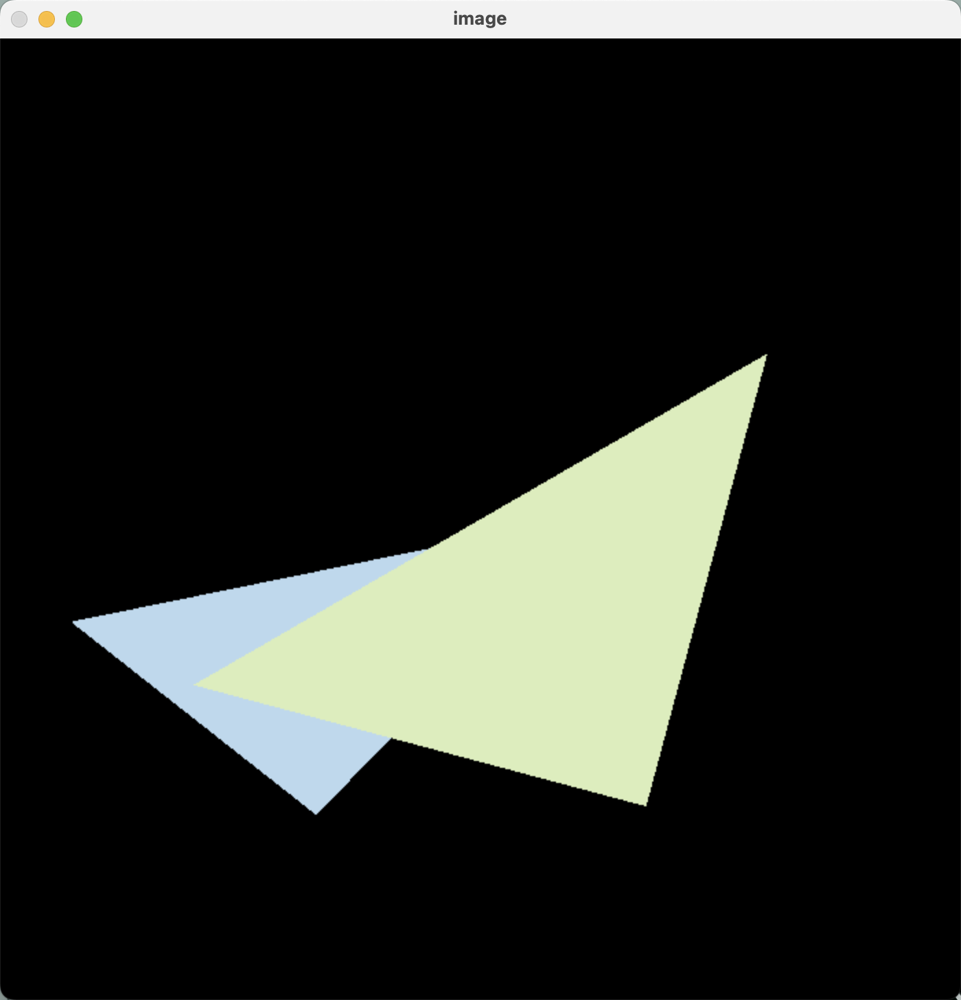
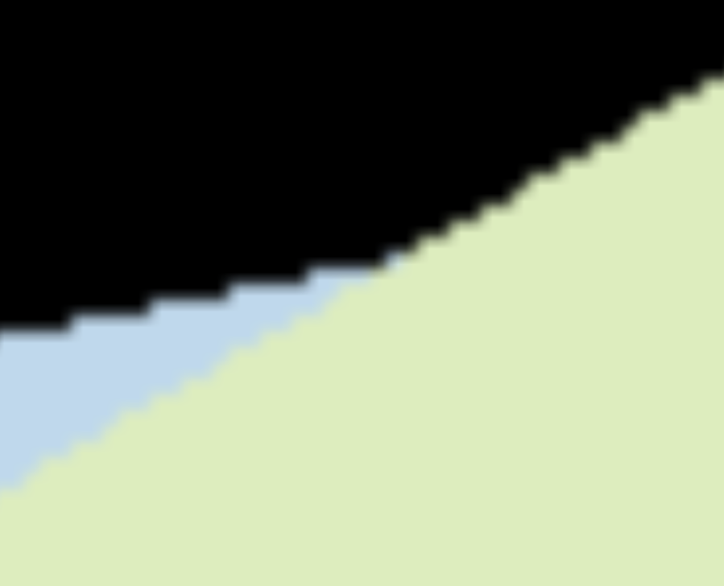
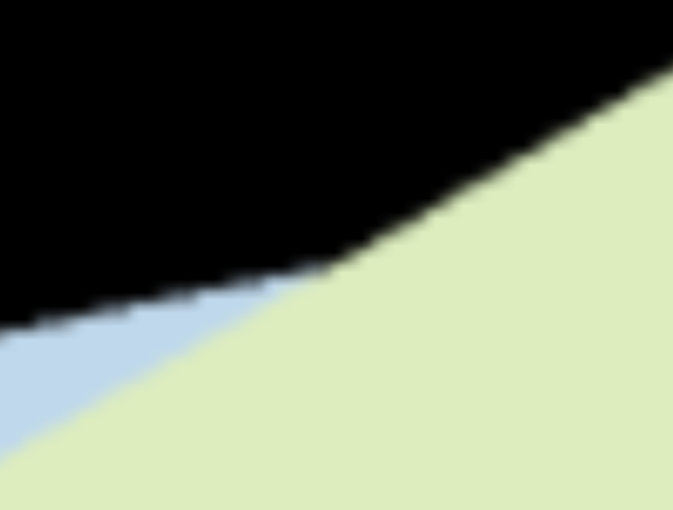

# FZU-CG-HomeWork01
102101244魏知乐

## 环境
系统：macOS Ventura13.5.2

编译器：Clang 14.0.3 arm64-apple-darwin22.4.0

IDE：VSCode

编译运行方式：CMake

```shell
# 切换到build文件夹下
cmake ../
make
./Rasterizer
```

## 代码描述
1. 在rasterizer.hpp加入一个成员变量代表超级采样的比率

```cpp
int ss_rate = 2; // super sampling rate
```

2. 在rasterizer.cpp加入2*2超级采样的光栅化函数

```cpp
// 初始化两个采样点的缓冲区，大小视为长宽分别扩大ss_rate倍，并且在clear函数中加入刷新逻辑
ss_depth_buf.resize(ss_rate * w * ss_rate * h);
ss_frame_buf.resize(ss_rate * w * ss_rate * h);

void rst::rasterizer::draw(pos_buf_id pos_buffer, ind_buf_id ind_buffer, col_buf_id col_buffer, Primitive type)
{
        ...
        ...
        ss_rasterize_triangle(t);
    }

    // render the depth and color of the pixel
    for (int x = 0; x < width; x++) {
        for (int y = 0; y < height; y++) {
            Vector3f pixel_color(0.0f, 0.0f, 0.0f);
            // 遍历每个采样点，计算像素点的RGB颜色
            for (int ss_x = 0; ss_x < ss_rate; ss_x++) {
                for (int ss_y = 0; ss_y < ss_rate; ss_y++) {
                    int index = get_index(x*ss_rate+ss_x, y*ss_rate+ss_y);
                    pixel_color += ss_frame_buf[index];
                }
            }
            pixel_color /= ss_rate * ss_rate;
            Vector3f p;
            p.x() = x;
            p.y() = y;
            set_pixel(p, pixel_color);
        }
    }
}


void rst::rasterizer::ss_rasterize_triangle(const Triangle& t) {
    auto v = t.toVector4();
    int min_x = 1000, min_y = 1000, max_x = 0, max_y = 0;

    for(auto e : v) {
        min_x = fmin(min_x, e.x());
        min_y = fmin(min_y, e.y());
        max_x = fmax(max_x, e.x());
        max_y = fmax(max_y, e.y());
    }

    for (int x = min_x; x < max_x; x++) {
        for (int y = min_y; y < max_y; y++) {
            // 根据ss_rate循环各个小采样点
            for (int ss_x = 0; ss_x < ss_rate; ss_x++) {
                for (int ss_y = 0; ss_y < ss_rate; ss_y++) {
                    // 获取中心坐标值
                    float sample_x = x + (ss_x + 0.5) / ss_rate;
                    float sample_y = y + (ss_y + 0.5) / ss_rate;
                    // 判断是否在三角形内
                    if(insideTriangle(sample_x, sample_y, t.v)) {
                        float alpha, beta, gamma;
                        std::tie(alpha, beta, gamma) = computeBarycentric2D(sample_x, sample_y, t.v);
                        float w_reciprocal = 1.0 / (alpha / v[0].w() + beta / v[1].w() + gamma / v[2].w());
                        float z_interpolated = alpha * v[0].z() / v[0].w() + beta * v[1].z() / v[1].w() + gamma * v[2].z() / v[2].w();
                        z_interpolated *= w_reciprocal;
                        // 获取小像素坐标的索引值
                        /*
                        * 我重写了这个函数，将整个画板看作扩大 ss_rate * ss_rate 倍
                        */
                        int ss_index = get_index(x*ss_rate + ss_x, y*ss_rate + ss_y);
                        // 与ss_depth_buf做深度缓冲计算，并且自定义了一个画板像素点缓冲ss_frame_buf。如果深度值较小，就替换采样点深度值，并且更新采样点颜色
                        if (z_interpolated < ss_depth_buf[ss_index]) {
                            ss_depth_buf[ss_index] = z_interpolated;
                            ss_frame_buf[ss_index] = t.getColor();
                        }
                    }
                }
            }
        }
    }
}
int rst::rasterizer::get_index(int x, int y)
{
    return y * width * ss_rate + x;
}
```

## 效果展示

由于mac系统似乎会自动对展示的图片做抗锯齿处理，所以效果并没有特别明显。

> 没有抗锯齿





> 有抗锯齿


