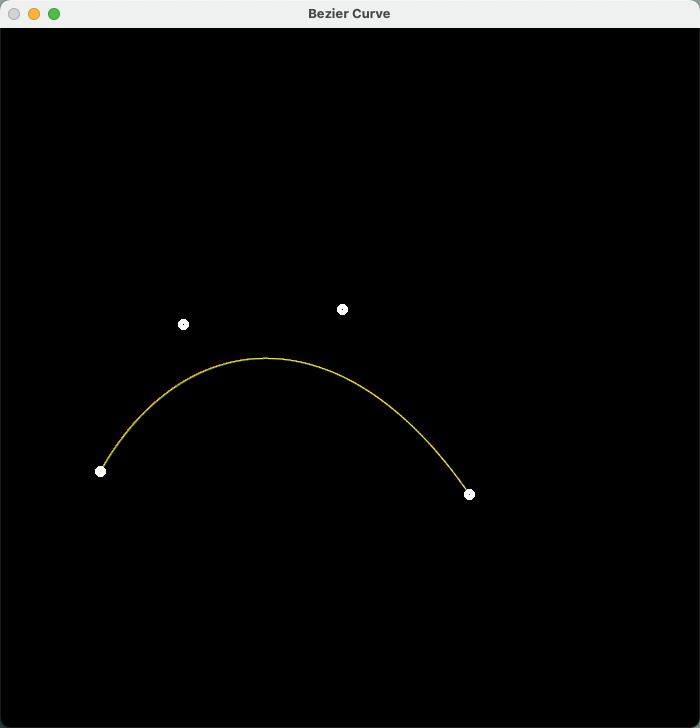
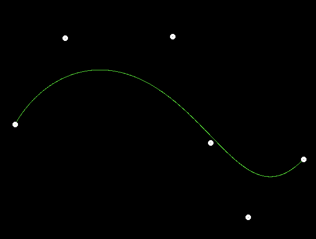
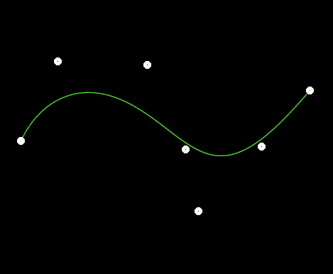
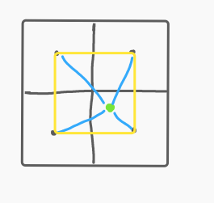

# Assignment02

##### check list

- ~~正确地提交所有必须的文件，且代码能够编译运行。~~ 
- ~~De Casteljau 算法：对于给定的控制点，你的代码能够产生正确的 Bézier 曲线。~~ 
- ~~实现对 Bézier 曲线的反走样。~~


## 效果展示

- 递归算法正确性：同时绘制两种贝塞尔曲线，重合为黄色



- 未做反走样的曲线效果



- 2x2反走样效果



## 功能函数介绍

1. 递归算法：

设置递归出口为当入参的vector大小为1时，即只剩最后一个点时返回这个点，这个点就是要求的贝塞尔曲线在t时刻的点。

```c++
cv::Point2f recursive_bezier(const std::vector<cv::Point2f> &control_points, float t) 
{
    if (control_points.size() == 1) {
        return control_points[0];
    }
    std::vector<cv::Point2f> points;
    for (long i = 1; i < control_points.size(); i++) {
        auto p1 = control_points[i-1];
        auto p2 = control_points[i];
        // the de Casteljau's algorithm
        auto p = (1-t) * p1 + t * p2;
        points.push_back(p);
    }
    return recursive_bezier(points, t);
}
```

2. 功能入口函数：

step是全局变量，可以根据需要设置更细致的step，这边是0.001作为step。

将绘制部分抽离为一个函数，方便对照反应反走样的效果

```c++
void bezier(const std::vector<cv::Point2f> &control_points, cv::Mat &window) 
{
    for (double t = 0.0; t <= 1.0; t += step) {
        auto point = recursive_bezier(control_points, t);
        draw_with_anti_aliasing(point, window);
    }
}
```

3. 反走样函数：

这个反走样方法主打的就是简单易懂。



根据给定的点坐标和图像，对该点周围的2x2像素区域进行反走样处理。如图，绿点为贝塞尔曲线计算出的点实际位置，因此对其x和y轴坐标分别做向下取整，必定能够得到黄色正方形的左下角那个像素点，所以离绿点最近的四个像素点就能很容易的用循环找到。

然后分别计算每个像素点到给定点的距离，也就是蓝线。在我的算法中，认为蓝线区间是[0, sqrt(2)]，所以蓝线越短，绿色的rgb值就越高。

最后在绘制的时候要注意使用一个fmax函数，如果要绘制的点已经被绘制过了，那么要判断将要绘制的颜色如果更深，才能绘入。否则绘制出来的曲线会断断续续。

```c++
void draw_with_anti_aliasing(cv::Point2f point, cv::Mat &window) {
    for (int dx = 0; dx < 2; ++dx) {
        for (int dy = 0; dy < 2; ++dy) {

            int px = floor(point.x) + dx;
            int py = floor(point.y) + dy;
            cv::Point2f p = cv::Point2f(px, py);
          
            auto w_p = p - point;
            double max_d = sqrt(2);
            double d = sqrt(w_p.x * w_p.x + w_p.y * w_p.y);
            double weight = 1 - d / max_d;
            window.at<cv::Vec3b>(p.y, p.x)[1] = std::fmax(255 * weight, window.at<cv::Vec3b>(p.y, p.x)[1]);
        }
    }
}
```