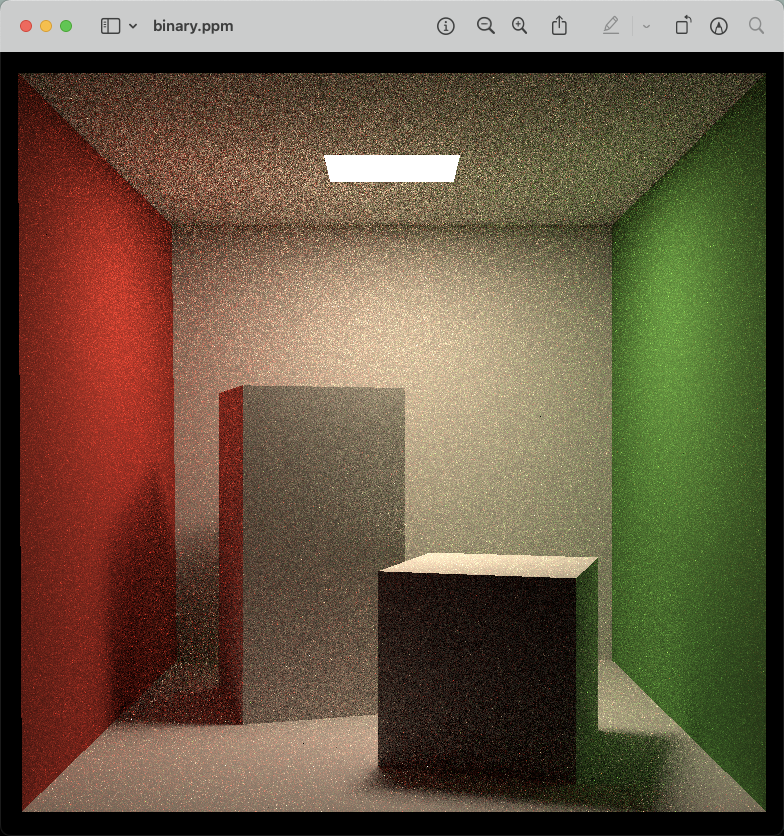
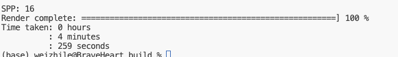
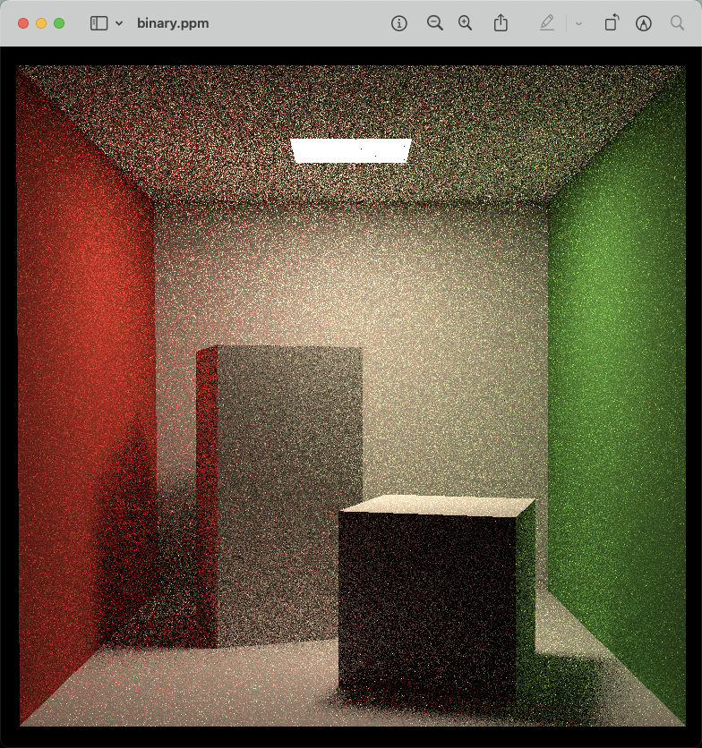
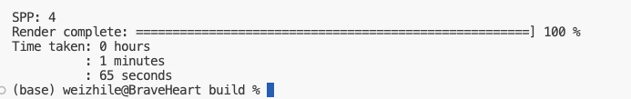

102101244 魏知乐 计算机科学与技术2班

---------

### Finished Tasks:

1. ~~使用Möller Trumbore算法进行光线-三角形相交判断~~
2. ~~建立BVH来加速求交过程~~
3. ~~实现PathTracing 算法~~

### 思考点：

1. 多线程加速：我的设备是mac，自带的Apple Clang不支持OpenMP，就没有办法快速的实现多线程加速。

2. 数值精度问题：

   - pdf接近0的情况出现噪点：应该是pdf接近于0时，除以它计算得到的颜色会偏向极限值，体现在图上也就是白色。所以我在计算indir的时候，先判断当前点的pdf，如果太小，就干脆把它的Radiance当成0，不计算它的光强了。

   ```c++
   if (rInter.happened && !rInter.m->hasEmission() &&  pInter.m->pdf(ray.direction, wi, N) > EPSILON ) {
           L_indir = ...;
       }
   ```

   - sampleLight 时判断光线是否被挡的边界情况: 我是判断物体到光源采样点的距离和物体射向采样点的Intersection的distance是否偏差超过EPSILON。之前用老师给的默认的EPSILON，是会出现横向黑色条纹的，估计就是被误以为是遮挡了。后面把EPSILON改大一点，0.01这样，效果就很好了。

   ```c++
   if (p2xInter.happened && p2xInter.distance - (x - p).norm() > -EPSILON) {
           L_dir = ...;
       }
   ```

3. 光源区域为纯黑: 对照渲染公式，可以发现伪代码中没有计算物点本身的发光的Emission，这样会导致当光线打到光源上时，只计算了其他物体给它的反光效果，忽略了它本身材质的光强度。这样其他物体没差别，但是光源没了。

我的方法是在每次castRay返回时加上物点本身的强度`pInter.m->getEmission()`。

我看有的人是在每次castRay开始的时候判断物点是不是光源，是的话就直接返回它的光强。

这样虽然结果差不多，但我觉得还是差点意思，因为光源也是有可能会反射光线的，按照我这样的方法每次都返回，我觉得比较科学一点？

### 实验结果：



图片在images文件夹下 spp16.img



SPP为16，场景大小不改变的情况下，耗时在4分钟左右。

---------



SPP为4时，耗时在一分钟左右


